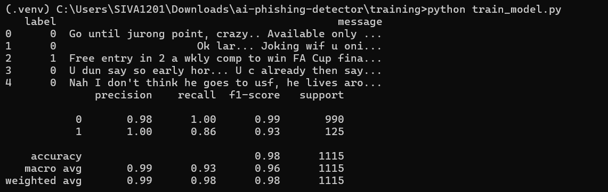
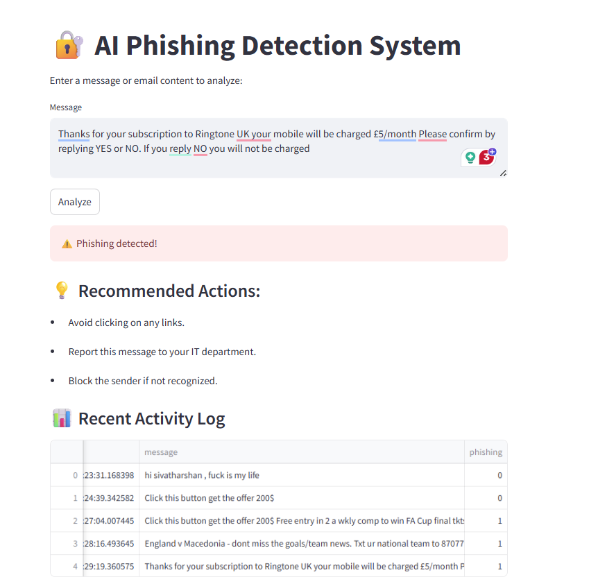

# AI for Phishing Detection, Prevention, and Remediation

This project uses machine learning to detect phishing messages (email/SMS), suggests prevention/remediation steps, and provides a real-time dashboard using Streamlit.

## Features

- Detects phishing in messages using NLP
- FastAPI backend for inference and action suggestions
- Streamlit dashboard for real-time monitoring

## Classification Model Accuracy report

## Dashboard using Streamlit!

## API Integration
